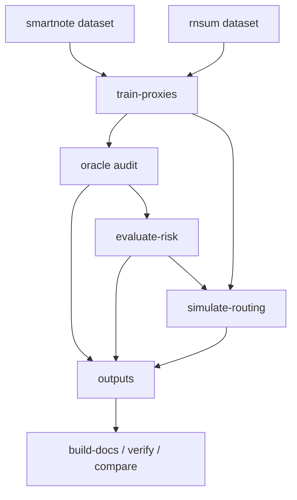

# Architecture

## Stage contracts

- `train-proxies` creates model and score columns for both datasets.
- `audit` labels sampled rows with an LLM-oracle policy.
- `evaluate-risk` computes risk/cost acceptance metrics and CI bands.
- `simulate-routing` simulates threshold behavior and oracle usage.
- `build-docs` materializes reference manifest and reproducibility metadata.
